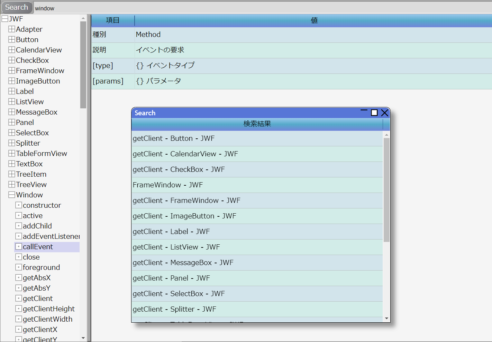

# TypeDoc Viewer

[動作サンプルページ](https://javascript-windowframework.github.io/TypeDocViewer/)

## 内容
　JSWフレームワークを利用したTypeDocViewer
　TypeDoc形式のJSONデータをSPAで表示する
　[JSW](https://github.com/JavaScript-WindowFramework/JSW)用サンプル

## 作成者
[空雲](https://croud.jp/)

## ターゲット
TypeScript+ES5(JavaScript)
IE11で動作するレベルのDOM

## ライセンス
[MIT License](https://opensource.org/licenses/mit-license.php)
